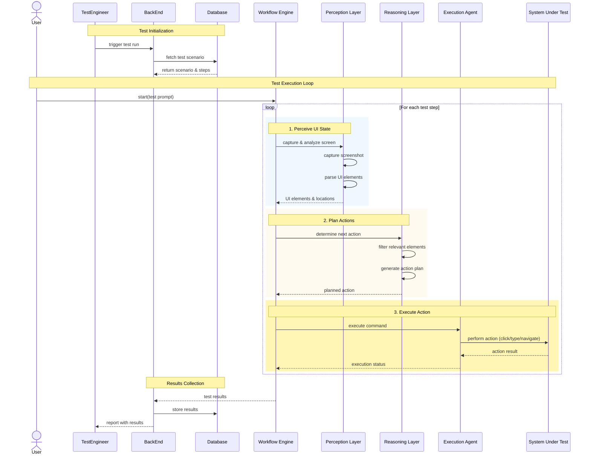
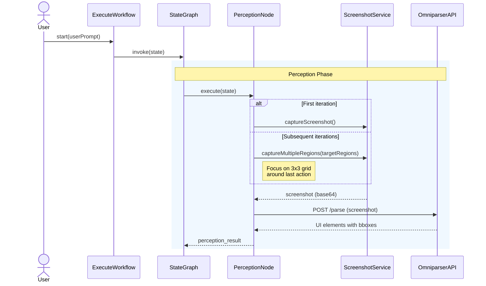
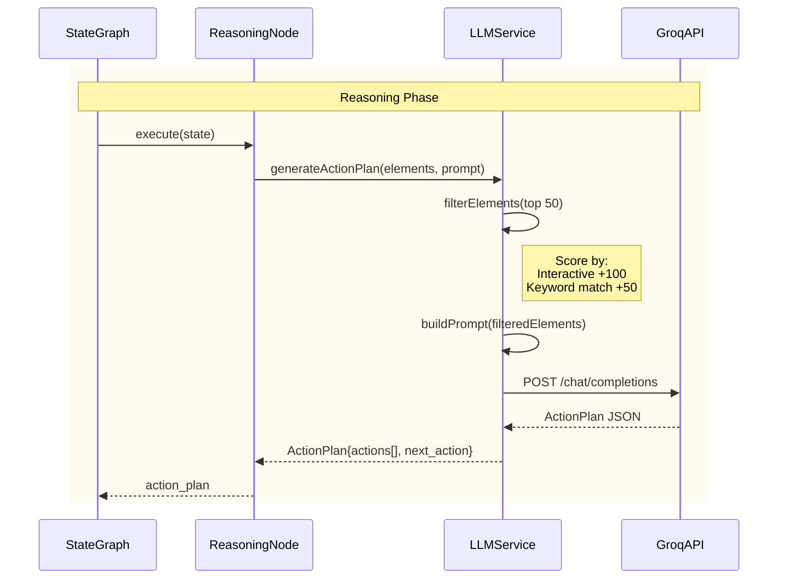

# System Diagrams

This document provides a breakdown of the **Perception Phase** and **Reasoning Phase** of the workflow using sequence diagrams.  

---

## 📑 Table of Contents
- [Perception Phase](#perception-phase)
- [Reasoning Phase](#reasoning-phase)

--- 
  ## Bird view for project

---

## 🔹 Perception Phase

The **Perception Phase** is responsible for capturing and analyzing the UI state of the system. It handles screenshot capturing, parsing via the Omni API, and generating perception results.

## 🔹 Reasoning Phase

The **Reasoning Phase** interprets the perception results, filters possible UI actions, builds a prompt for the LLM, and retrieves the action plan from the Groq API.

